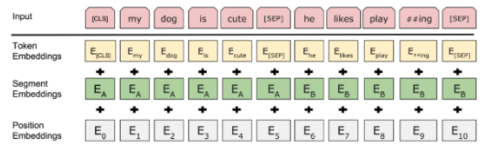

# Vizziest - Making **Vis**ualization Ea**siest** for Everyone

**Pairing visualization tasks with proper languages, libraries and tools**

MIDS W210.6 Fall 2019 Capstone Project Repository - [visualization_search_engine](https://github.com/graceyqlin/visualization_search_engine)

**JCGY Team Members:** [Jeffrey Braun](mailto:jbraun@ischool.berkeley.edu), [Chi Iong Ansjory](mailto:ansjory@ischool.berkeley.edu), [Yuqing (Grace) Lin](mailto:ylin@ischool.berkeley.edu), [Yang Yang Qian](yangyang.qian@ischool.berkeley.edu)

**Project Website:** [Vizziest - Making Visualization Easiest for Everyone](https://ucbiyyq.github.io/ucbiyyq-w210-jcgy/)

**Capstone Project Gallery:** [Vizziest: Making Visualization Easiest for Everyone](https://www.ischool.berkeley.edu/projects/2019/vizziest-making-visualization-easiest-everyone)

**Final Presentation Slide Deck:** [Vizziest](docs/img/portfolio/vizziest.pdf)

**All Class Presentation Slide Decks:** [Additional Resources](#additional-resources)

## Table of Content

- [Problem Statement](#problem-statement)
- [Mission Statement](#mission-statement)
- [Impact](#impact)
- [MVP Key Features](#mvp-key-features)
- [Overall Architecture](#overall-architecture)
- [Data Pipeline](#data-pipeline)
- [Data Feature Engineering](#data-feature-engineering)
- [Mockup UI Backend Connection](#mockup-ui-backend-connection)
- [Models](#models)
- [Model Evaluations](#model-evaluations)
- [Project Website](#project-website)
- [Additional Resources](#additional-resources)

## Problem Statement

People wanting to create data visualizations are faced with reading through and vetting multiple search results to find the guidance they need to create a visualization that fits their need. While they will eventually find an answer, it takes time and energy.


## Mission Statement

Vizziest takes the time, frustration, and guesswork out of finding actionable guidance for creating the data visualization that best meets the user’s business requirements.

Our hypothesis is that given a problem domain such as visualization, we can create models on top of knowledge repositories to generate more helpful, targeted advice than a user would get from a generalized search engine. Once developed, this approach can generalize to other problem domains, for example, predicting data science models most appropriate for a user's business need.

## Impact

Our earlier [survey](https://www.mysurveygizmo.com/s3/5231057/Creating-Data-Visualizations) of data scientists and business analysts with [result 1](https://drive.google.com/file/d/1oUGaKxJ1l6I_gCochS7xaTQvEle4b9OJ/view?usp=sharing) and [result 2](https://data.surveygizmo.com/r/677654_5df13dec9ca5b5.71244476) indicated that, on average, they create 8.2 data visualizations per month. Assuming they spend 15 minutes per visualization searching for code examples and guidance for each visualization, that means they spend 24.6 hours per year finding answers. The goal of Vizziest is to dramatically reduce this time.


## MVP Key Features

**User** *enters* general description of desired viz task, optional filters

**Vizziest** *presents* ideas for type of vizs that may accomplish **user**'s goal

**User** *selects* desired type of viz

**Vizziest** *predicts* the question from its knowledge corpus that most closely *matches* **user** requirements

**Vizziest** *examines* the answers associated with the questions, *predicts* and *displays* the best answers based on factors like actionability (instruction steps, sample output, code, pros/cons/cautions, etc.)

**Vizziest** *captures* **user** feedback if **Vizziest** fails to recommend an answer the **user** *likes*

## Overall Architecture

It is a clean and simple 3-tier architecture. The user interacts with input UI to type in the query in plaintext format, and it passes to the parser through the backend interface. Based on the user option selected, either the TF-IDF or BERT model is being built based on the data files with feature engineering done. Our data files were preprocessed from the Stack Overflow archives. With the tokens and the model ready, the predicted recommendations for user's query will be passed back to the frontend for output UI to present to the user.


## Data Pipeline

Starting with Stack Overflow [data](https://docs.google.com/spreadsheets/d/1xn4ECk20CwKSk25AcO76Y9frnklSlEfxmWK58LW31bA/edit?usp=sharing), which is large corpus with rick Q&A feature possibilities. The initial audience focus is people with some development skills. Additional data sources to be considered are Stack Exchange Data Science community, Github with developer focused, and Reddit with power user focused.


Our development and deployment environment is [Google Cloud Platform](https://console.cloud.google.com). GCP commands via [Cloud SDK](https://cloud.google.com/sdk/) for individual [GCP VM instance](https://console.cloud.google.com/compute/instances?project=w210-jcgy-254100&authuser=1&instancessize=50) access, and mount point for persistent data stored in the [GCP Bucket](https://console.cloud.google.com/storage/browser/w210-jcgy-bucket?authuser=1&project=w210-jcgy-254100) are:

```
gcloud projects list
gcloud config set project w210-jcgy-254100
gcloud config list
gcloud compute regions list
gcloud config set compute/zone us-east1-b
gcloud compute ssh --ssh-flag="-L 8896:127.0.0.1:8896" --ssh-flag="-L 6006:127.0.0.1:6006" [yangyq|yqian|jbraun|ansjory|yqlin]@instance-1
conda activate w210
git status
git pull --all
cd /mnt/disks/w210-jcgy-bucket/
jupyter notebook
```

## Data Feature Engineering

There are two sources to get our data. One is directly download from Stack Overflow website. Those files are XML files and Python scripts were written to get the keys, create dictionaries, and then parse them to CSV files. Given the size of the dataset, we also wrote scripts to split and combine the files to usable format. We also obtained the data from Google BigQuery. Then we [filter](https://docs.google.com/document/d/1FlyOfoKquoQ9H7dW6dW9FXpEt-RV4gE_Vzbdk8LYIKE/edit) data and use parsed tags data to set to only visualization related topics, narrowing them down to around [700k](https://drive.google.com/drive/u/0/folders/10JDNEzLMDvlUYBtTPThrj2Qqz0L7I9ei) questions and then [450k](https://drive.google.com/drive/u/0/folders/1BG3flmbfoqNO_B2wRBvhDamrDLgD1Hgk) questions. We cleaned up and reorganized the question and answer bodies to make them human readable. As the tags in the original questions data are not separated by spaces, we have to use one-hot encoding to get usable tag features. We further extract more features for answers dataset to include author reputation, badges, codes and instruction steps. The latest processed data is stored at GCP Bucket.

## Mockup UI Backend Connection

UI mockup tool [Balsamiq](https://balsamiq.com/) is used to design, storyboard, and user-test our frontend UI.


URL domain name [vizziest.info](http://vizziest.info) was acquired from domain.com for 1-year period. Following configurations are required on the GCP VM instance based on this [tutorial](https://stories.mlh.io/launch-your-first-website-with-domain-com-and-google-cloud-platform-b0d72c448b6f):
- Check "Allow HTTP Traffic" under Firewall rule when creating the VM instance
- Redirect port 80 traffic using iptables firewall rule
```
sudo iptables -t nat -A PREROUTING -p tcp --dport 80 -j REDIRECT --to-port 3000
```
- Connect our domain to Google Cloud DNS
  - Create zone under Network Services with Zone type as "Public", Zone name as "Vizziest", and DNS name as "vizziest.info"
  - Add record set with Resource Record Type as "A", IPv4 Address as "External IP" of VM instance "35.237.81.204"
  - Under domain.com, change Nameserver to the following:
    ```
    ns-cloud-c1.googledomains.com
    ns-cloud-c2.googledomains.com
    ```

Our web server is spawned from same GCP VM instance in data pipeline for easy user (frontend) and prediction (backend) data exchange. Our simple frontend web UI is a free-form style question input and answer output. The data connection from and to backend is through Flask and Jinja interacting with Python code. 
```
sudo apt-get update
sudo apt-get install python3-pip
pip3 install pandas
pip3 install gensim
pip3 install nltk
pip3 install flask
export FLASK_ENV=development
python3 app.py
nohup python3 app.py > output.log &
ps ax | grep app.py
```

To browse the Vizziest application being served with the python3 command under webapp directory on local machine, go to http://127.0.0.1:5000/; on GCP VM instance, go to http://vizziest.info

## Models

Latent Dirichlet Allocation ([LDA](https://medium.com/@lettier/how-does-lda-work-ill-explain-using-emoji-108abf40fa7d)), a topic modeling technique in NLP, is attempted during the initial EDA and expected to obtain fuzzy cluster membership recommendation. When we apply this technique on our viz post question dataset, we expect to identify top 10 to 50 "topics" based on LDA and try to extrapolate relationship between "topics" and chart types. However, we fail to associate each "topic" to a unique chart type selection.

Then we look into Term Frequency - Inverse Document Frequency ([TF-IDF](http://www.tfidf.com/)), a vector space model for cosine similarity, for question recommendation, with variation of Unigram, Bigram, and [Word2vec](https://en.wikipedia.org/wiki/Word2vec), [Sentence2vec](https://medium.com/@premrajnarkhede/sentence2vec-evaluation-of-popular-theories-part-i-simple-average-of-word-vectors-3399f1183afe). We would use the total number of documents in the corpus divided by the number of documents where the term appears. Then we use cosine similarity to calculate the distance between different documents and output the top questions with the highest similarity scores. TF-IDF is fast by using text frequency to determine importance with no linguistic contexts. Word2vec and Sentence2vec are pretrained model based on Google News by neural networks trained to reconstruct linguistic contexts of words, but limited to Google News data.

Then we will use [Logistic Regression](https://towardsdatascience.com/logistic-regression-detailed-overview-46c4da4303bc) for answer recommendation based on features like comment counts, author reputation, and view counts. The numerator is total number of documents in the corpus and denominator is number of documents where the term appears. The set of documents in a collection then is viewed as a set of vectors in a vector space to find similarity between two documents.

We are also looking at the potential application of Bidirectional Encoder Representation from Transformers ([BERT](https://towardsdatascience.com/bert-explained-state-of-the-art-language-model-for-nlp-f8b21a9b6270)) model with next sentence prediction ([NSP](http://www.eis.mdx.ac.uk/research/groups/ai/reading/1810.04805.pdf)), [similarity measure](https://medium.com/the-artificial-impostor/news-topic-similarity-measure-using-pretrained-bert-model-1dbfe6a66f1d), [text classification](https://medium.com/swlh/a-simple-guide-on-using-bert-for-text-classification-bbf041ac8d04), and [SQuAD](https://rajpurkar.github.io/SQuAD-explorer/) approach. In general, BERT aims for better semantic understanding of search terms with transfer learning. We used a pretrained BERT model from Hugging Face in Pytorch. We need two sentences or "spans" for NSP: user's input becomes one span and Stack Overflow accepted answer bodies is the second span. The assumption is that the question should be semantically closer to the accepted answer body than other bodies.



## Model Evaluations

For this project, we limited our knowledge base to visualization-related question and answer posts in Stack Overflow. To evaluate our model, we will ask potential users to enter sample questions into Vizziest and into Stack Overflow's native search bar. The users will be asked to rank the userfulness of the top answers provided by Vizziest compared to the top answers provided by Stack Overflow. One major challenge that we face for all our models is the fact the we do not have labeled data as "ground truth". Thus, we must rely on subjective evaluations to determine the effectiveness of our models.

We acquired testers to identify the question most similar to questions in a test suite. To choose from, the testers were given questions recommended by our TF-IDF unigram, word2vec and sentence2vec models. The [survey](https://forms.gle/BAvATVBemGCwXCmB6) incorporated models of TF-IDF, Unigram, Bigram and Word2vec is for 105 respondents through Mechanical Turk to choose the most similar questions so as to evaluate recommendation systems.

Here is a summary of the survey results with preference on TF-IDF Uni-gram:
* 52% of respondents chose TF-IDF Uni-gram
* 31% of respondents chose Stack Overflow search engine
* 10% of respondents chose Word to Vector
* 7% of respondents chose Sentence to Vector

Similar [survey](https://forms.gle/kDHmgmFhReHg8ydr8) was conducted for BERT model against other models as well on 100 respondents through Mechanical Turk. Here is the summary of survey results also with preference on TF-IDF Uni-gram:
* 62% of respondents chose TF-IDF Uni-gram
* 27% of respondents chose Stack Overflow search engine
* 11% of respondents chose BERT


The key takeaways for the evaluations are survey respondents tend to prefer results from TF-IDF against BERT based on the quality of the answers. We limited the VM instance with 1 GPU and 11k question-answer pairs, the response time tends to scale linearly with number of samples. So for search application overall, simple TF-IDF model offers better performance at lower cost than BERT.


## Project Website

[Vizziest website](https://ucbiyyq.github.io/ucbiyyq-w210-jcgy/) were built based on [Jekyll](https://jekyllrb.com/) support. It is supported in Github environment under docs directory. Following commands need to be run in the local environment. Go to http://127.0.0.1:4000/ upon serving.
```
sudo gem install jekyll bundler
bundle init
gem "jekyll" in Gemfile
jekyll serve
```


## Additional Resources

* [Week 14 Presentation 3](https://docs.google.com/presentation/d/15oKzgl3USPItpqjKc6EadOLzsUdqpHfu3xeozCo-XxA/edit#slide=id.g7a70253d8d_0_18)
* [Week 10 Presentation 2](https://docs.google.com/presentation/d/1M5llKflCqmPuugS7w5dXMTWEy4Q2loXvacZyqIPS7W4/edit#slide=id.g64e6dbcd63_0_0)
* [Week 7 Communication and Storytelling Workshop](https://docs.google.com/presentation/d/1Dc3RShvwhcIsi3HX5cOaITeRkrjx0cbvw5ENN8EJ59k/edit?usp=sharing)
* [Week 5 Presentation 1](https://docs.google.com/presentation/d/1gIKujbJHFY7V9X2ZZIskhfv7tjDtLovV-u2LAL6eI1E/edit#slide=id.p)
* [Week 4 Project Writeup](https://docs.google.com/document/d/1R3Gx72YorSwzzPwlFmFwitgEcGAbYN2VXmzLjm_4NVc/edit?usp=sharing) with [Revised Project Scope](https://drive.google.com/open?id=1rNXevUmSY0ZNaLx80u638e4V4dZk71a66spoaqABluU)
* [Vizziest Task List Sheet](https://docs.google.com/spreadsheets/d/1sDwbgM8OFQyg-vm2y0Fxh65E7CKBu4WI5oaMcItEZuA/edit?usp=sharing)
* [Initial Task List Sheet and Feedback List](https://docs.google.com/spreadsheets/d/19ff4Nb30oHjf4JloauIVDLaRFCyLj3CD4S25JKwEFF0/edit#gid=0)

@ 2019 by [Vizziest](https://ucbiyyq.github.io/ucbiyyq-w210-jcgy/). Proudly created by JCGY team.
